# 经典双塔模型
DSSM(Deep Structured Semantic Model):

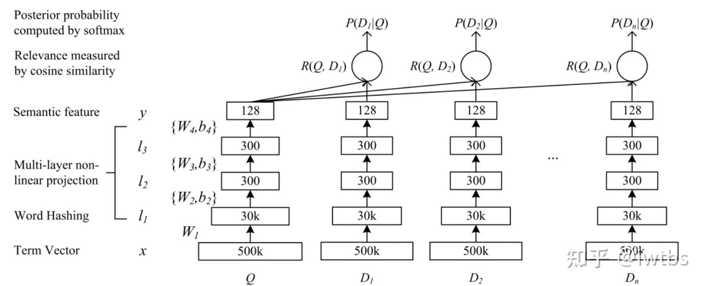

+ 主要思想就是query的embedding去访问doc的embedding(计算余弦相似度), 目的是比较query和doc之间的相关性
+ 特点或者说缺陷, 主要是query和doc各自的embedding都是自己管自己生成的, 在浅层没有对特征进行交叉, 在最后才进行余弦相似度计算, 在浅层都是自己内部特征融合, 这就会导致浅层的关键特征被一些噪声削弱, 到最后计算的时候用到的特征可能会比较弱

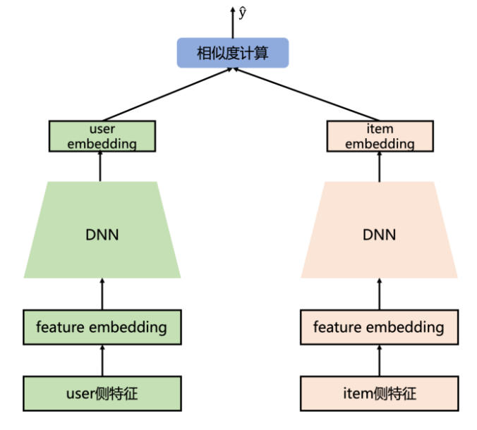

+ 同理, 分为user侧和item侧, 利用各自的特征进行embedding, 最后进行特征交叉(相似度计算)
+ 缺点也是没有考虑到浅层做特征embedding的时候把噪音融合到了重要 feature 中

**优化方案：SENet双塔模型**

# SENet双塔模型

它做了什么?

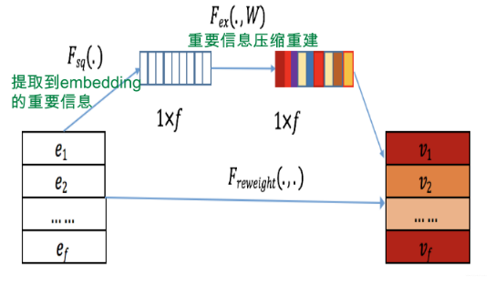

Squeeze, Excitation, Re-weight 三阶段

1. Squeeze阶段：我们对每个特征的Embedding向量进行数据压缩与信息汇总，即在Embedding维度计算均值：

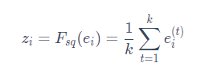

其中k表示Embedding的维度，Squeeze阶段是将每个特征的Squeeze转换成单一的数值。

2. Excitation阶段：这阶段是根据上一阶段得到的向量进行缩放，然后在放回原维度。这个过程的具体操作就是经过两层DNN。

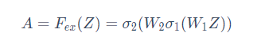

该过程可以理解为：对于当前所有输入的特征，通过相互发生关联，来动态地判断哪些特征重要，哪些特征不重要，而这体现在Excitation阶段的输出结果 A，其反应每个特征对应的重要性权重。

3. Re-weight阶段：是将Excitation阶段得到的每个特征对应的权重 A 再乘回到特征对应的Embedding里，就完成了对特征重要性的加权操作。

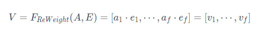

于是, 原来朴素的双塔模型被优化成这样:
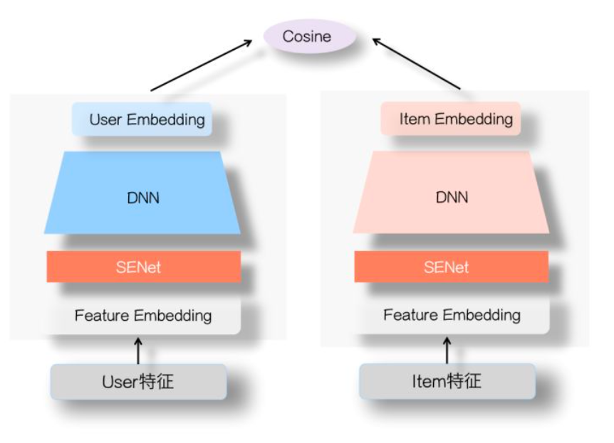

+ 即在dnn之前的浅层, 先过一个SENet做一个特征的筛选, 除去噪音, 放大关键特征, 使得后面的DNN进行内部特征融合的时候, 一个关键特征不会被噪声冲刷得太厉害

因此SENet双塔模型主要是从特征选择的角度，提高了两侧特征交叉的有效性，减少了噪音对有效信息的干扰，进而提高了双塔模型的效果。此外，除了这样的方式，还可以通过增加通道的方式来增强两侧的信息交互。即对于user和item两侧不仅仅使用一个DNN结构，而是可以通过不同结构(如FM，DCN等)来建模user和item的自身特征交叉，例如下图所示：

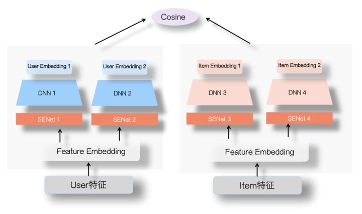

这样对于user和item侧会得到多个embedding，类似于多兴趣的概念。通过得到的多个user和item的embedding，然后分别计算余弦值再相加(两侧的Embedding维度需要对齐)，进而增加了双塔两侧的信息交互。而这种方法在腾讯进行过尝试，他们提出的“并联”双塔就是按照这样的思路，感兴趣的可以了解一下。

# 多目标的双塔模型

现如今多任务学习在实际的应用场景也十分的常见，主要是因为实际场景中业务复杂，往往有很多的衡量指标，例如点击，评论，收藏，关注，转发等。在多任务学习中，往往会针对不同的任务使用一个独有的tower，然后优化不同任务损失。那么针对双塔模型应该如何构建多任务学习框架呢？

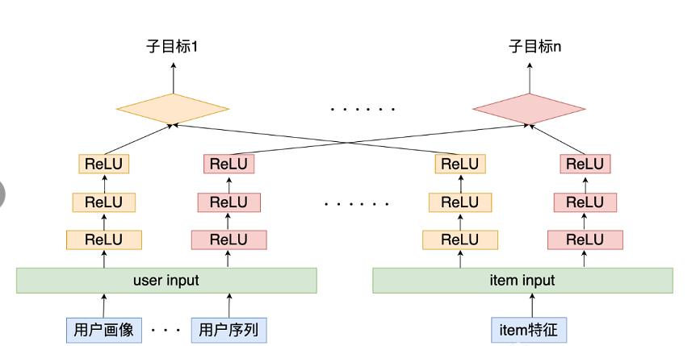

如上图所示，在user侧和item侧分别通过多个通道(DNN结构)为每个任务得到一个user embedding和item embedding，然后针对不同的目标分别计算user 和 item 的相似度，并计算各个目标的损失，最后的优化目标可以是多个任务损失之和，或者使用多任务学习中的动态损失权重。

这种模型结构，可以针对多目标进行联合建模，通过多任务学习的结构，一方面可以利用不同任务之间的信息共享，为一些稀疏特征提供其他任务中的迁移信息，另一方面可以在召回时，直接使用一个模型得到多个目标预测，解决了多个模型维护困难的问题。也就是说，在线上通过这一个模型就可以同时得到多个指标，例如视频场景，一个模型就可以直接得到点赞，评论，转发等目标的预测值，进而通过这些值计算分数获得最终的Top-K召回结果。

 

# YouTube双塔

## YouTube 神经召回模型
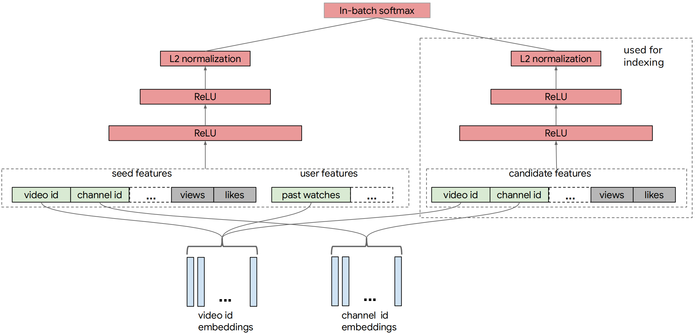

在任何时间点，用户正在观看的视频，即种子视频，都会提供有关用户当前兴趣的强烈信号。因此，本文利用了大量种子视频特征以及用户的观看历史记录。候选塔是为了从候选视频特征中学习而构建的。

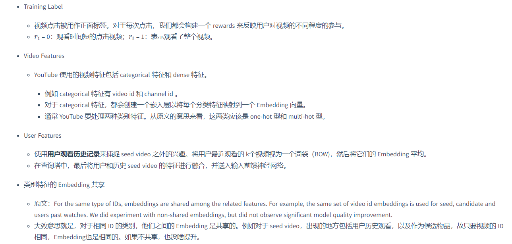
