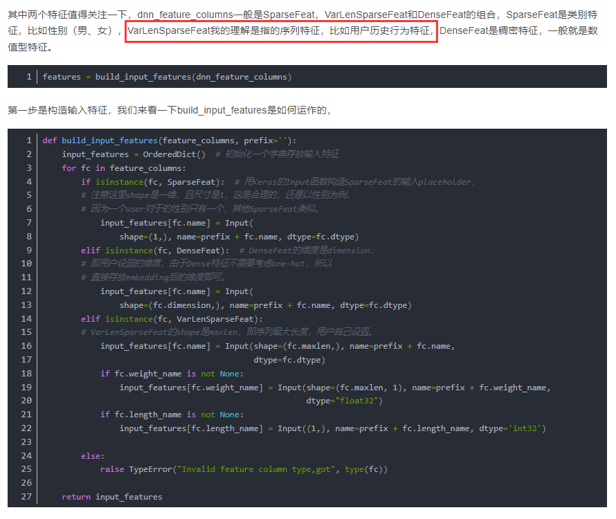
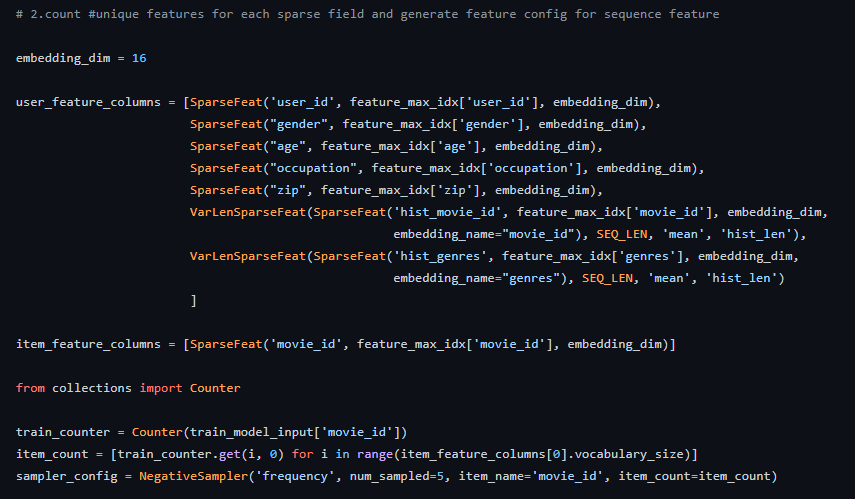
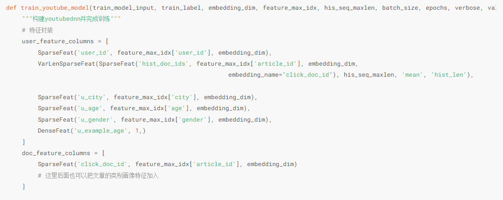

# YouTubeDNN


> 三种embedding方法对应的数据类型



> user_embedding和item_embedding由来





## 重要函数和步骤

```python
def youtubednn_recall(data, topk=200, embedding_dim=8, his_seq_maxlen=50, negsample=0,
                      batch_size=64, epochs=1, verbose=1, validation_split=0.0):
    """通过YouTubeDNN模型，计算用户向量和文章向量
    param: data: 用户日志数据
    topk: 对于每个用户，召回多少篇文章
    """
    user_id_raw = data[['user_id']].drop_duplicates('user_id')      # 存原始的 user_id
    doc_id_raw = data[['article_id']].drop_duplicates('article_id') # 存原始的 article_id
    
    # 类别数据编码   
    base_features = ['user_id', 'article_id', 'city', 'age', 'gender']  # 基本特征
    feature_max_idx = {}
    for f in base_features:
        lbe = LabelEncoder()  # 构造一个LabelEncoder实例, 用来把分类指标转化为编号(如['aaa', 'bbb', 'ccc', 'aaa']->[0, 1, 2, 0])
        data[f] = lbe.fit_transform(data[f])  # 把基本特征都转化为编号
        feature_max_idx[f] = data[f].max() + 1  # 记录当前feature最大的编号, 也就是统计有几个不同的类, +1是因为原来是 0~n-1, 现在让他变成 1~n, 在构造词典的时候用到
        
    # 构建用户id词典和doc的id词典，方便从用户idx找到原始的id
    user_id_enc = data[['user_id']].drop_duplicates('user_id')        # 存一下类别转化为编号后的 user_id
    doc_id_enc = data[['article_id']].drop_duplicates('article_id')   # 存一下类别转化为编号后的 article_id
    user_idx_2_rawid = dict(zip(user_id_enc['user_id'], user_id_raw['user_id']))    # 构造 {编号: 原类名} 的映射
    doc_idx_2_rawid = dict(zip(doc_id_enc['article_id'], doc_id_raw['article_id'])) # 构造 {编号: 原类名} 的映射
    
    # 保存下每篇文章的被点击数量， 方便后面高热文章的打压
    doc_clicked_count_df = data.groupby('article_id')['click'].apply(lambda x: x.count()).reset_index()  # 存一下每篇文章的点击量
    doc_clicked_count_dict = dict(zip(doc_clicked_count_df['article_id'], doc_clicked_count_df['click']))  # 构造 {文章: 点击量} 的映射

    train_set, test_set = gen_data_set(data, doc_clicked_count_dict, negsample, control_users=True)  # 构造训练集和测试集
    
    # 构造youtubeDNN模型的输入
    train_model_input, train_label = gen_model_input(train_set, his_seq_maxlen)  # 构造 model 的输入格式
    test_model_input, test_label = gen_model_input(test_set, his_seq_maxlen)     # 构造 model 的输入格式
    
    # 构建模型并完成训练
    model = train_youtube_model(train_model_input, train_label, embedding_dim, feature_max_idx, his_seq_maxlen, batch_size, epochs, verbose, validation_split)
    
    # 获得用户embedding和doc的embedding， 并进行保存
    user_embs, doc_embs = get_embeddings(model, test_model_input, user_idx_2_rawid, doc_idx_2_rawid)  # 得到用户和文章的向量(训练后)
    
    # 对每个用户，拿到召回结果并返回回来
    user_recall_doc_dict = get_youtube_recall_res(user_embs, doc_embs, user_idx_2_rawid, doc_idx_2_rawid, topk)  # 对每个用户召回
    
    return user_recall_doc_dict
  


```


```python
# 构造训练集和测试集
def gen_data_set(click_data, doc_clicked_count_dict, negsample, control_users=False):
    """构造youtubeDNN的数据集"""
    # 按照曝光时间排序
    click_data.sort_values("expo_time", inplace=True)  # 根据曝光时间排序(新到旧)
    item_ids = click_data['article_id'].unique()  # 拿到左右被点击过的文章id
    
    train_set, test_set = [], []
    for user_id, hist_click in tqdm(click_data.groupby('user_id')):  # 分别取行为的 (用户, [历史点击行为]), 这里用groupby把用户单独分离出来
        # 这里按照expo_date分开，每一天用滑动窗口滑，可能相关性更高些,另外，这样序列不会太长，因为eda发现有点击1111个的
        #for expo_date, hist_click in hist_date_click.groupby('expo_date'):
        # 用户当天的点击历史id
        pos_list = hist_click['article_id'].tolist()  # 取历史点击过的文章id数组
        user_control_flag = True  # 控制打压高热文章
        
        if control_users:  # 控制在某个用户上不能采样太多, 用于惩罚活跃用户
            user_samples_cou = 0
        
        # 过长的序列截断
        if len(pos_list) > 50:  # 取最近的50条记录
            pos_list = pos_list[-50:]

        if negsample > 0:
            neg_list = gen_neg_sample_candiate(pos_list, item_ids, doc_clicked_count_dict, negsample, methods='multinomial')
        
        # 只有1个的也截断 去掉，当然我之前做了处理，这里没有这种情况了
        if len(pos_list) < 2:
            continue
        else:
            # 序列至少是2
            for i in range(1, len(pos_list)):  # 遍历最近的一些点击行为
                hist = pos_list[:i]  # hist 存一下除了最后一次点击外的所有点击行为, 即用 0~i-1 , 之后用来推荐第 i 条.
                # 这里采用打压热门item策略，降低高展item成为正样本的概率
                freq_i = doc_clicked_count_dict[pos_list[i]] / (np.sum(list(doc_clicked_count_dict.values())))
                p_posi = (np.sqrt(freq_i/0.001)+1)*(0.001/freq_i)
                
                # p_posi=0.3  表示该item_i成为正样本的概率是0.3，
                if user_control_flag and i != len(pos_list) - 1: # # 控制打压高热文章
                    if random.random() > (1-p_posi):  # 随机数大于 1-p_posi 表明为正样本
                        # 采样, 这时候是限定了一个user_id的, 根据这个 user_id 的历史行为, 来构造一个样本, 且为正样本
                        row = [user_id, hist[::-1], pos_list[i], hist_click.iloc[0]['city'], hist_click.iloc[0]['age'], hist_click.iloc[0]['gender'], hist_click.iloc[i]['example_age'], 1, len(hist[::-1])]
                        train_set.append(row)
                        
                        for negi in range(negsample):
                            row = [user_id, hist[::-1], neg_list[i*negsample+negi], hist_click.iloc[0]['city'], hist_click.iloc[0]['age'], hist_click.iloc[0]['gender'], hist_click.iloc[i]['example_age'], 0, len(hist[::-1])]
                            train_set.append(row)
                        
                        if control_users:
                            user_samples_cou += 1
                            # 每个用户序列最长是50， 即每个用户正样本个数最多是50个, 如果每个用户训练样本数量到了30个，训练集不能加这个用户了
                            if user_samples_cou > 30:   # 打压活跃用户的行为
                                user_samples_cou = False  # 感觉这里应该是 user_control_flag=false ?
                
                # 整个序列加入到test_set， 注意，这里一定每个用户只有一个最长序列，相当于测试集数目等于用户个数
                elif i == len(pos_list) - 1:
                    row = [user_id, hist[::-1], pos_list[i], hist_click.iloc[0]['city'], hist_click.iloc[0]['age'], hist_click.iloc[0]['gender'], 0, 0, len(hist[::-1])]
                    test_set.append(row)
    
    
    random.shuffle(train_set)
    random.shuffle(test_set)
    
    return train_set, test_set   

```

> 构造特定的格式来适应封装的api

```python
def gen_model_input(train_set, his_seq_max_len):
    """构造模型的输入"""
    # row: [user_id, hist_list, cur_doc_id, city, age, gender, label, hist_len]
    train_uid = np.array([row[0] for row in train_set])
    train_hist_seq = [row[1] for row in train_set]
    train_iid = np.array([row[2] for row in train_set])
    train_u_city = np.array([row[3] for row in train_set])
    train_u_age = np.array([row[4] for row in train_set])
    train_u_gender = np.array([row[5] for row in train_set])
    train_u_example_age = np.array([row[6] for row in train_set])
    train_label = np.array([row[7] for row in train_set])
    train_hist_len = np.array([row[8] for row in train_set])
    
    train_seq_pad = pad_sequences(train_hist_seq, maxlen=his_seq_max_len, padding='post', truncating='post', value=0)
    train_model_input = {
        "user_id": train_uid,
        "click_doc_id": train_iid,
        "hist_doc_ids": train_seq_pad,
        "hist_len": train_hist_len,
        "u_city": train_u_city,
        "u_age": train_u_age,
        "u_gender": train_u_gender, 
        "u_example_age":train_u_example_age
    }
    return train_model_input, train_label


```

> 封装特征, 告诉模型哪些是离散型、哪些是有时序信息的、哪些是连续型

```python
def train_youtube_model(train_model_input, train_label, embedding_dim, feature_max_idx, his_seq_maxlen, batch_size, epochs, verbose, validation_split):
    """构建youtubednn并完成训练"""
    # 特征封装
    user_feature_columns = [
        SparseFeat('user_id', feature_max_idx['user_id'], embedding_dim),
        VarLenSparseFeat(SparseFeat('hist_doc_ids', feature_max_idx['article_id'], embedding_dim,
                                                        embedding_name="click_doc_id"), his_seq_maxlen, 'mean', 'hist_len'),    
        
        SparseFeat('u_city', feature_max_idx['city'], embedding_dim),
        SparseFeat('u_age', feature_max_idx['age'], embedding_dim),
        SparseFeat('u_gender', feature_max_idx['gender'], embedding_dim),
        DenseFeat('u_example_age', 1,)
    ]
    doc_feature_columns = [
        SparseFeat('click_doc_id', feature_max_idx['article_id'], embedding_dim)
        # 这里后面也可以把文章的类别画像特征加入
    ]
    
    # 定义模型
    model = YoutubeDNN(user_feature_columns, doc_feature_columns, num_sampled=5, user_dnn_hidden_units=(64, embedding_dim))
    
    # 模型编译
    model.compile(optimizer="adam", loss=sampledsoftmaxloss)
    
    # 模型训练，这里可以定义验证集的比例，如果设置为0的话就是全量数据直接进行训练
    history = model.fit(train_model_input, train_label, batch_size=batch_size, epochs=epochs, verbose=verbose, validation_split=validation_split)
    
    return model

```

+ 然后就是建模型，编译训练即可。这块就非常简单了，当然模型方面有些参数，可以了解下，另外一个注意点，就是这里用户特征和item特征进行了分开， 这其实和双塔模式很像， 用户特征最后编码成用户向量， item特征最后编码成item向量。

> 获得用户向量和item向量 模型训练完之后，就能从模型里面拿用户向量和item向量

```python
# 获取用户embedding和文章embedding
def get_embeddings(model, test_model_input, user_idx_2_rawid, doc_idx_2_rawid, save_path='embedding/'):
    doc_model_input = {'click_doc_id':np.array(list(doc_idx_2_rawid.keys()))}
    
    user_embedding_model = Model(inputs=model.user_input, outputs=model.user_embedding)
    doc_embedding_model = Model(inputs=model.item_input, outputs=model.item_embedding)
    
    # 保存当前的item_embedding 和 user_embedding 排序的时候可能能够用到，但是需要注意保存的时候需要和原始的id对应
    user_embs = user_embedding_model.predict(test_model_input, batch_size=2 ** 12)
    doc_embs = doc_embedding_model.predict(doc_model_input, batch_size=2 ** 12)
    # embedding保存之前归一化一下
    user_embs = user_embs / np.linalg.norm(user_embs, axis=1, keepdims=True)
    doc_embs = doc_embs / np.linalg.norm(doc_embs, axis=1, keepdims=True)
    
    # 将Embedding转换成字典的形式方便查询
    raw_user_id_emb_dict = {user_idx_2_rawid[k]: \
                                v for k, v in zip(user_idx_2_rawid.keys(), user_embs)}
    raw_doc_id_emb_dict = {doc_idx_2_rawid[k]: \
                                v for k, v in zip(doc_idx_2_rawid.keys(), doc_embs)}
    # 将Embedding保存到本地
    pickle.dump(raw_user_id_emb_dict, open(save_path + 'user_youtube_emb.pkl', 'wb'))
    pickle.dump(raw_doc_id_emb_dict, open(save_path + 'doc_youtube_emb.pkl', 'wb'))
    
    # 读取
    #user_embs_dict = pickle.load(open('embedding/user_youtube_emb.pkl', 'rb'))
    #doc_embs_dict = pickle.load(open('embedding/doc_youtube_emb.pkl', 'rb'))
    return user_embs, doc_embs

```

> 向量最邻近索引

```python
def get_youtube_recall_res(user_embs, doc_embs, user_idx_2_rawid, doc_idx_2_rawid, topk):
    """近邻检索，这里用annoy tree"""
    # 把doc_embs构建成索引树
    f = user_embs.shape[1]
    t = AnnoyIndex(f, 'angular')
    for i, v in enumerate(doc_embs):
        t.add_item(i, v)
    t.build(10)
    # 可以保存该索引树 t.save('annoy.ann')
    
    # 每个用户向量， 返回最近的TopK个item
    user_recall_items_dict = collections.defaultdict(dict)
    for i, u in enumerate(user_embs):
        recall_doc_scores = t.get_nns_by_vector(u, topk, include_distances=True)
        # recall_doc_scores是(([doc_idx], [scores]))， 这里需要转成原始doc的id
        raw_doc_scores = list(recall_doc_scores)
        raw_doc_scores[0] = [doc_idx_2_rawid[i] for i in raw_doc_scores[0]]
        # 转换成实际用户id
        try:
            user_recall_items_dict[user_idx_2_rawid[i]] = dict(zip(*raw_doc_scores))
        except:
            continue
    
    # 默认是分数从小到大排的序， 这里要从大到小
    user_recall_items_dict = {k: sorted(v.items(), key=lambda x: x[1], reverse=True) for k, v in user_recall_items_dict.items()}
    
    # 保存一份
    pickle.dump(user_recall_items_dict, open('youtube_u2i_dict.pkl', 'wb'))
    
    return user_recall_items_dict
```

以上主要是要会使用annoy这个包, 用来做一个knn


[参考](https://datawhalechina.github.io/fun-rec/#/ch02/ch2.1/ch2.1.2/YoutubeDNN?id=quotexample-agequot%e7%89%b9%e5%be%81)
